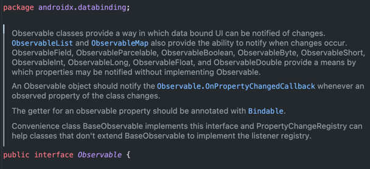
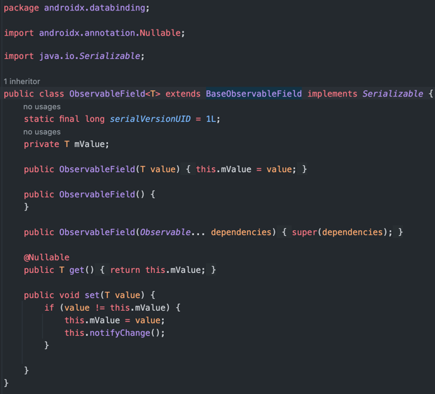
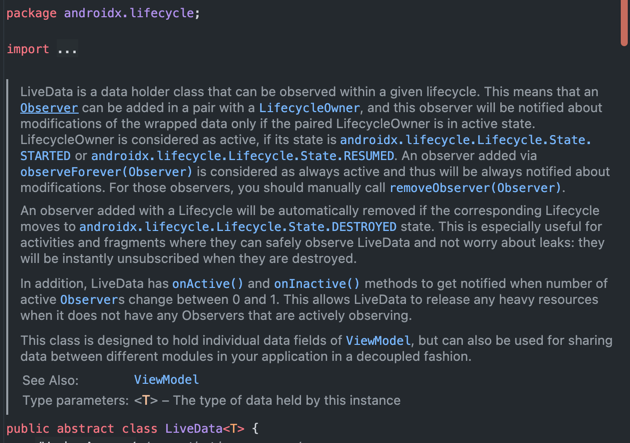
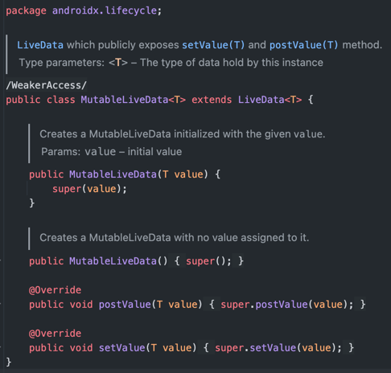

# ObservableField와 LiveData의 이해(+ Data Binding와 결합하기)

> **한 줄 소개**  
> ObservableField와 LiveData의 개념과 차이점, 활용 방법을 알아보는 글입니다.

## 목차
### 1️⃣ 데이터 바인딩의 기본 개념
- 데이터 바인딩이란?
- 데이터 바인딩의 중요성

### 2️⃣ ObservableField와 LiveData 개념
- **ObservableField 개념**
  - ObservableField란 무엇인가?
  - ObservableField의 장점과 단점
  - ObservableField의 사용 예제 

- **LiveData란?**
  - LiveData란 무엇인가?
  - LiveData의 장점과 단점
  - LiveData의 사용 예제

### 3️⃣ ObservableField와 LiveData 비교
- 두 데이터 홀더의 개념적 차이점
- ObservableField vs LiveData 선택 기준
  - 성능 및 메모리 관리 측면에서의 비교

### 4️⃣ ObservableField와 LiveData를 활용한 데이터 바인딩
- 단방향 데이터 바인딩에서의 ObservableField와 LiveData
- 양방향 데이터 바인딩에서의 ObservableField와 LiveData

<br>

## 1️⃣ 데이터 바인딩의 기본 개념
### 데이터 바인딩이란?

데이터 바인딩이란 레이아웃의 UI 구성 요소를 프로그래밍 방식이 아닌 선언적 형식을 사용하여 앱의 데이터 소스에 바인딩할 수 있는 라이브러리입니다.
데이터 바인딩은 코드의 복잡성을 줄이고, 유지보수성을 높이며, 자동으로 뷰에 데이터를 넘겨주어 UI와 데이터 간의 연결을 쉽게 해주는 기술입니다.

> **데이터 바인딩의 주요 기능**

- **레이아웃 변수 및 표현식(expression)**  
레이아웃 파일에서 데이터 객체를 직접 참조할 수 있습니다. 
이를 통해 레이아웃에서 데이터의 속성을 직접 사용하거나, 데이터를 사용하는 표현식을 작성할 수 있습니다.


- **레이아웃 관찰**  
LiveData나 Observable과 같은 관찰 가능한 데이터 패턴을 지원합니다.


- **이벤트 처리**  
레이아웃에서 이벤트 핸들러를 직접 참조하거나 호출할 수 있다. 이를 통해 레이아웃에서 직접 클릭 이벤트를 처리할 수 있습니다.

따라서, 데이터 바인딩은 UI와 데이터를 간단하고 효율적으로 연결할 수 있는 도구입니다.

### 데이터 바인딩의 중요성
데이터 바인딩은 레이아웃을 사용할 때 몇가지 장점을 제공합니다. 간단한 예로 아래와 같이 `findViewById(..)`를 호출하지 않고 뷰를 사용할 수 있게 해줍니다.
```kotlin
    findViewById<TextView>(R.id.name).apply {
        text = viewModel.userName
    }
```
<br>

> **데이터 바인딩의 장점**
- **데이터 바인딩 클래스 자동 생성 및 타입 안정성**
    ```xml
    <layout xmlns:android="http://schemas.android.com/apk/res/android"
    xmlns:app="http://schemas.android.com/apk/res-auto">
        <data>
            <variable
            name="viewmodel"
            type="com.myapp.data.ViewModel" />
        </data>
        
        <ConstraintLayout... />
    </layout>
    ```
  
    데이터 바인딩을 사용하려면 위 코드와 같이 `<layout>` 태그로 레이아웃 XML 전체를 둘러싸서 데이터 바인딩용 레이아웃 파일로 변경하면 됩니다. 
    `<layout>` 태그는 이 레이아웃에 데이터 바인딩을 한다는 것을 나타냅니다. 레이아웃에 이 태그가 있으면 데이터 바인딩 라이브러리가 바인딩 클래스를 자동으로 생성해줍니다.  
    <br>
    바인딩 클래스를 자동으로 생성해 주기 때문에 코드에서 잘못된 ID를 참조하거나 잘못된 타입으로 캐스팅할 위험을 줄입니다. 자동 생성된 데이터 바인딩 클래스는 레이아웃에서 뷰의 ID와 타입을 기반으로 생성되므로 컴파일 시점에 오류를 검출할 수 있습니다.
    따라서 컴파일 시간에 타입 검사를 수행하므로, 런타임 오류를 줄이고 코드의 안정성을 향상시킵니다.
   
  <br>

- **중복 코드 감소**  
  <br>
  데이터 바인딩을 사용하면 `findViewById()`를 이용해 뷰를 찾고, 데이터를 설정하는 등의 UI 업데이트와 관련된 반복적인 코드를 줄일 수 있습니다. 
  데이터 바인딩 클래스가 자동으로 생성되기 때문에 각 뷰에 대해 `findViewById()`를 사용할 필요가 없고, XML에서 정의한 데이터를 코드에서 수동으로 연결하지 않아도 됩니다.

   <br>

-  **UI와 데이터 간의 양방향 바인딩 (Two-Way Binding)**  
   <br>
   데이터 바인딩을 사용하면 데이터와 UI 요소 간의 양방향 데이터 바인딩을 구현할 수 있습니다. 즉, 데이터 변경 사항이 자동으로 UI에 반영되고, 사용자가 UI를 통해 데이터를 변경하면 데이터도 자동으로 업데이트됩니다.
   예를 들어, 사용자가 입력한 값을 EditText에 바인딩하면, 뷰 모델에서 데이터를 변경하는 즉시 UI에 반영되고, 사용자가 데이터를 수정하면 뷰 모델에도 반영되어 즉시 UI에도 반영됩니다.
   ```xml
    <EditText
        android:id="@+id/editText"
        android:layout_width="match_parent"
        android:layout_height="wrap_content"
        android:text="@={viewModel.userName}" />
   ```
   `@={viewModel.userName}`와 같이 `@={}` 표기법을 이용해 데이터를 송신하는 동시에 사용자 입력한 값도 수신할 수 있습니다.

<br>

## 2️⃣ ObservableField와 LiveData 개념
### ObservableField 개념
> **Observable이란?**  
 
ObservableField에 대해 이야기하기 전에 `Observable`에 대해 알아보겠습니다.

  `Observable`은 데이터가 연결된 UI에 변경 사항을 알릴 수 있는 방법을 제공합니다.`Observable`은 아래 사진에서 보이듯이 `interface` 입니다. 

  
`Observable`을 구현한 클래스들은 `LiveData`처럼 변경 사항을 알려주는 관찰 가능한 클래스가 됩니다.
`Observable` 객체는 클래스 내에서 관찰된 프로퍼티가 변경될 때마다 `Observable.OnPropertyChangedCallback`에 알려야 합니다.

<br>

> **ObservableField란 무엇인가?**  

ObservableField란 객체를 관찰할 수 있도록 만들어주는 객체 래퍼입니다. 객체 뿐만 아니라 필드의 변경도 관찰할 수 있습니다.
데이터가 변경되었을 때 UI가 자동으로 업데이트되도록 하여 UI와 데이터 모델 간의 상호작용을 쉽게 만들어 줍니다.

`ObservableField.class`


위 이미지를 보면 `ObservableField`는 `androidx.databinding` 패키지에 포함되어 있는 것을 확인할 수 있습니다.

<br>

> **ObservableField의 장점과 단점**

**ObservableField의 장점**
- **직관적이고 쉬움**  
  사용법이 매우 직관적이어서, `LiveData`와 달리 추가적인 개념을 학습하지 않고도 쉽게 이해하고 사용할 수 있습니다. 데이터 바인딩과 함께 사용할 때 매우 유용하며, 추가적인 라이브러리나 설정 없이 바로 데이터를 바인딩할 수 있습니다.

**ObservableField의 단점**
- **생명주기 인식 X**  
  ObservableField는 생명주기(LifecycleOwner)를 인식하지 못합니다. 즉, Activity나 Fragment가 비활성화 상태에 있어도 값이 변경될 수 있고, 그로 인해 메모리 누수 등의 문제가 발생할 수 있습니다.


- **비동기 작업에 적합하지 않음**  
  ObservableField는 비동기 작업에 대한 지원을 제공하지 않습니다. 네트워크 작업이나 데이터베이스 쿼리와 같은 비동기 작업을 처리할 때는 별도의 비동기 처리 방식이 필요합니다. 또한, 비동기 작업이 완료된 후 UI에 결과를 반영하기 위한 추가적인 코드가 필요합니다.

<br>

> **ObservableField의 사용 예제**  

(추후 작성)

<br>

### LiveData란?
> **LiveData란 무엇인가?**  

`LiveData`는 앱의 데이터를 관찰 가능한 형태로 제공하는 데이터 홀더 클래스입니다.  
`LiveData`는 UI 컴포넌트와 ViewModel, 모델 간 상호 작용을 용이하게 하며, 데이터의 변경을 감지하고 이에 따른 업데이트를 자동으로 받아올 수 있습니다.



<br>

> **LiveData의 장점과 단점**  

**LiveData의 장점**
- **UI가 데이터 상태와 일치하는지 보장**  
 LiveData는 관찰자 패턴을 따릅니다. LiveData는 기본 데이터가 변경될 때 Observer 객체에 알려 UI를 업데이트할 수 있습니다. 즉, 앱 데이터가 변경될 때마다 관찰자가 UI를 업데이트하므로 개발자가 업데이트할 필요가 없습니다.


- **메모리 누수 방지**  
Observer 는 `Lifecycle` 객체에 결합되어 있으며 연결된 수명 주기가 끝나면 자동으로 삭제되기 때문에 메모리 누수를 방지할 수 있습니다.


- **Activity가 중단된 동안 크래시 발생 X**  
  Activity가 백 스택에 있을 때를 비롯해 Observer의 수명 주기가 비활성 상태라면 Observer는 어떤 LiveData 이벤트도 받지 않기 때문에 Activity가 중단된 동안 크래시 발생할 위험이 없습니다.


- **생명 주기를 자동으로 관리**  
UI 컴포넌트는 관련 데이터를 관찰하기만 할 뿐 관찰을 중지하거나 다시 시작하지 않습니다. LiveData는 관찰하는 동안 관련 수명 주기 상태의 변경을 인식하므로 수명주기를 자동으로 관리합니다.


- **적절한 구성 변경**  
기기 회전과 같은 구성 변경으로 인해 액티비티 또는 프래그먼트가 다시 생성되면 사용 가능한 최신 데이터를 즉시 받습니다.


 **LiveData의 단점**
 
(추후 작성)

<br>

> **LiveData의 사용 예제**  

**1. LiveData 선언**  
MutableLiveData로 선언하여 name의 변경사항을 트래킹할 수 있게 합니다.

`ViewModel.kt`
```kotlin
class ExampleViewModel : ViewModel() {
    private val _name = MutableLiveData<String>()
    val name: LiveData<String> get() = _name
    
    ...
}
```
일반적으로 MutableLiveData을 public하게 노출하기보다, 관찰 가능하지만 변경이 불가능한 LiveData 타입의 값을 노출하곤 합니다. Backing Property의 형태를 볼 수 있습니다.

**2. 값 업데이트**  



MutableLiveData 타입을 사용하였기 때문에 값을 업데이트할 수 있습니다. `setValue(T)` 및 `postValue(T)` 두 함수가 제공됩니다. `postValue(T)` 는 값을 바로 변경하지 않고 메인 스레드에게 작업을 할당합니다.

`MainViewModel.kt`
```kotlin
class MainViewModel : ViewModel() {
    private val _name = MutableLiveData<String>()
    val name: LiveData<String> get() = _name

    fun updateName(name: String) {
        _name.value = name
    }
}
```

**3. 변경사항 관찰(observe)**

`MainActivity.kt`
```kotlin
class MainActivity : AppCompatActivity() {
    private val viewModel: MainViewModel by viewModels()
    
    override fun onCreate(savedInstanceState: Bundle?) {
        super.onCreate(savedInstanceState)

        setContentView(binding.root)
        observeName()
        ...
    }
    
    private fun observeName() {
        viewModel.name.observe(this) {
            // 변화가 감지 되었을 떄 수행할 작업
        }
    }
}
```

<br>

## 3️⃣ ObservableField와 LiveData 비교
### 두 데이터 홀더의 개념적 차이점


|    특성     |   	ObservableField	   |                      LiveData                       
|:---------:|:---------------------:|:---------------------------------------------------:|
| 생명 주기 인식  |     생명주기를 인식하지 않음     |       생명주기를 인식하며, UI가 활성 상태일 때만 관찰자에게 데이터 전달        |
|  바인딩 방식   | 데이터 바인딩 라이브러리와 함께 사용됨 |              데이터 바인딩을 지원하며 생명 주기까지 관리               |
| 비동기 작업 처리 | 비동기 작업을 위한 특별한 기능 없음  | 비동기 작업 처리에 적합 (ViewModel과 Coroutines 또는 RxJava와 결합) |
|   구독 관리   | 수동으로 값을 업데이트하거나 관찰 필요 |              자동 구독 및 해제 관리 (메모리 누수 방지)              |
|   상태 관리   |       단일 값만 관리        |                복잡한 상태 관리 및 데이터 변환 가능                
| 변환 기능 | 값 변환 기능이 없음	| Transformations를 통해 값 변환 및 조합 가능 |

(표를 요약하는 글 필요)

<br>

## 4️⃣ ObservableField와 LiveData를 활용한 데이터 바인딩
우선 데이터 바인딩을 사용하려면 `build.gradle.kts(::app)` 파일에 databinding 사용 옵션을 설정해야 합니다.
```kotlin
android {
    ...
    buildFeatures {
        dataBinding = true
    }
}
```

databinding 사용 옵션을 설정 했다면 xml 파일에서 `layout` 태그를 설정해야 합니다. `option + enter(mac 기준)`를 활용하면 IDE가 자동으로 태그를 생성해 줍니다.

```xml
<layout xmlns:android="http://schemas.android.com/apk/res/android" 
    xmlns:app="http://schemas.android.com/apk/res-auto">
    
    <data>
        
        <variable
            name="viewmodel"
            type="com.myapp.data.ViewModel" />
    </data>
    ...
</layout>
```

<br>

### 단방향 데이터 바인딩에서의 ObservableField와 LiveData
**ObservableField를 이용해 DataBinding에서 변경사항 관찰하기**  
(추후 작성)

**LiveData를 이용해 DataBinding에서 변경사항 관찰하기**

`MainActivity.kt`
```kotlin
class MainActivity : AppCompatActivity() {
    private val binding: ActivityMainBinding by lazy { DataBindingUtil.setContentView(this, R.layout.activity_main) }
    private val viewModel: ExampleViewModel by viewModels()
    
    override fun onCreate(savedInstanceState: Bundle?) {
        super.onCreate(savedInstanceState)

        setContentView(binding.root)
        setupBinding()
        ...
    }
    
    private fun setupBinding() {
        binding.lifecycleOwner = this
        binding.viewmodel = viewModel
    }
}
```

`activity_main.xml`
```xml
<layout ...

    <data>
    
        <variable
            name="viewmodel"
            type="com.example.ui.MainViewModel" />
    </data>
    
    <TextView
        ...
        android:text="@{viewmodel.name}" />
```

<br>

### 양방향 데이터 바인딩에서의 ObservableField와 LiveData
(추후 작성)

<br>

### ObservableField vs LiveData 선택 기준
> **성능 및 메모리 관리 측면에서의 비교**
>
`LiveData`는 수명주기를 알고 있기 때문에 관찰자를 자동으로 관리하지만 `ObservableField`는 수명주기를 알지 못해 수동으로 관리해주어야 합니다. 그렇기 때문에 메모리 누수 면에서 `LiveData`가 유리하다고 할 수 있습니다.
`ObservableField`를 사용하면 `activity`가 종료되었는데도 관찰자가 계속 데이터를 관찰하고 있기 때문에 리소스가 낭비됩니다.


## 참고자료
- [안드로이드 공식 문서_DataBinding](https://developer.android.com/topic/libraries/data-binding)
- [안드로이드 공식 문서_Observable](https://developer.android.com/reference/android/databinding/Observable)
- [안드로이드 공식 문서_Work with observable data objects](https://developer.android.com/topic/libraries/data-binding/observability)
- [안드로이드 공식 문서_LiveData](https://developer.android.com/topic/libraries/architecture/livedata)
- 실무에 바로 적용하는 안드로이드 프로그래밍
- 우아한테크코스 모바인 안드로이드 레벨2 - 2024 강의 자료

